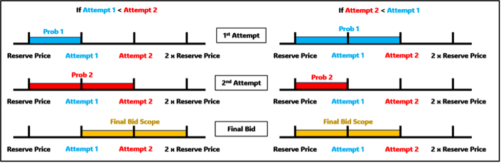
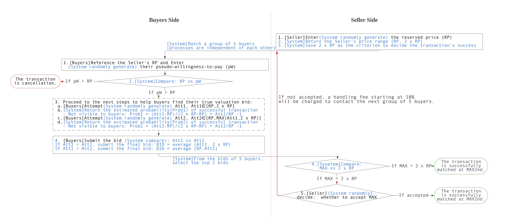
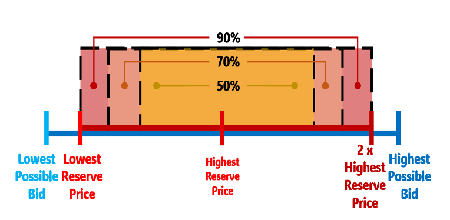

# Innovative Second-Hand Trading Platform 模型创新二手交易平台

## Introduction 项目简介
This project presents an innovative model combining second-price auction and probability estimation to optimize second-hand trading platforms. The model aims to improve transaction efficiency, fairness, and user satisfaction by streamlining the negotiation process and providing data-driven feedback for buyers and sellers.

本项目提出了一种创新模型，通过结合“第二价格拍卖”和“概率估计”机制，优化二手交易平台。该模型旨在通过简化议价流程并为买卖双方提供数据支持，提高交易效率、公平性以及用户满意度。

---

## Methodology 方法论

### Seller's Side 卖方部分
1. **Reserve Price (RP)**: Sellers set a minimum acceptable price for the transaction.
2. **Price Range**: The system defines the range as [RP, 2RP]. 
3. **Penalty Mechanism**: Sellers rejecting bids below their ideal price (IP) will incur penalties to ensure fairness.

1. **保留价格 (RP)**：卖方设定最低可接受价格。
2. **价格范围**：系统将范围定义为 [RP, 2RP]。
3. **惩罚机制**：拒绝低于理想价格 (IP) 的报价会受到惩罚，以确保公平。

### Buyer's Side 买方部分
1. **Two Attempts**: Buyers are given two opportunities to place bids, with the system providing feedback on success probabilities.
2. **Final Bid**: Based on the feedback, buyers determine their optimal bid.

1. **两次尝试**：买家有两次机会进行出价，系统将提供成功概率反馈。
2. **最终报价**：买家根据反馈调整出价，以优化交易。

---

## Research Analysis 研究分析

### i. Theoretical Analysis 理论分析
The system categorizes buyers into:
- **Risk-Neutral Buyers**: Follow a uniform distribution.
- **Risk-Averse Buyers**: Follow a normal distribution.

系统将买家分为：
- **风险中立买家**：服从均匀分布。
- **风险规避买家**：服从正态分布。

#### Combined Distributions 混合分布
The model assumes a 6:4 ratio between risk-neutral and risk-averse buyers, simulating transaction probabilities through a weighted distribution.

模型假设风险中立与风险规避买家比例为 6:4，通过加权分布模拟交易概率。

### ii. Outcome Evaluation 结果评估
- **Efficiency**: The system ensures a high transaction success rate (>50%) by minimizing delays and optimizing bid acceptance.
- **Fairness**: Balances power between buyers and sellers through transparent rules and penalties.
- **Strategyproof**: Buyers are incentivized to reveal their true valuations, promoting honest bidding.

- **效率**：通过减少延迟和优化报价接受，系统确保了高交易成功率（>50%）。
- **公平性**：通过透明的规则和惩罚机制平衡买卖双方的权力。
- **策略无关性**：买家被激励披露真实估值，从而促进诚实出价。

---

## Simulation Results 模拟结果
Below are the results from our Monte Carlo simulations:

以下为我们的蒙特卡罗模拟结果：

- **Success Rates Under Different Strategies**  
  | Buyers per Group | Conservative (50%) | Neutral (70%) | Aggressive (90%) |
  |------------------|---------------------|---------------|------------------|
  | 2 Buyers         | 0.45                | 0.46          | 0.47             |
  | 5 Buyers         | 0.51                | 0.57          | 0.63             |
  | 10 Buyers        | 0.51                | 0.65          | 0.72             |

---

## Figures 图片
### 1. Final Bid Process 最终出价流程

### 2. Transaction Flow Chart 交易流程图

### 3. Graphical Illustration of Sellers’ Pricing Strategies 卖方定价策略图解

### 4. Simulation Results for Different Strategies 不同策略的模拟结果

---

## Conclusion 结论
Our model enhances second-hand trading platforms by addressing efficiency and fairness. Future improvements could refine the penalty system and accommodate high-value items with smaller buyer groups.

我们的模型通过解决效率和公平性问题，优化了二手交易平台。未来改进可以完善惩罚机制，并针对高价值商品采用更小规模的买家群体。

---

## Contributors 项目贡献者
- Rong Xia
- Xuefan Zhuang
- Yiqi Zang
- Haiwen Yin
- Liqun Yang

